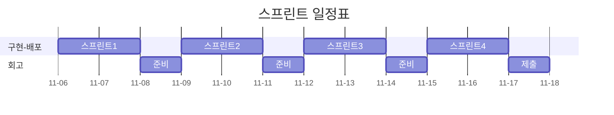

# 오픈미션 회고

---

**막막한 감정을 넘어(2025-11-04 TU)**  
이번 오픈미션에 대한 설명을 듣고나서 막막한 감정을 마주하고 말았다. 아마 지난 3주간 구체적인 문제와 제약조건이 있는 상황에 익숙해진 탓도 있으리라 생각했다.

얼마전 한강으로 산책을 나갔다가 눈앞의 탁 트인 풍경에 어지러움을 느꼈다. 지난 주차까지 밤낮으로 모니터만 보던 나의 눈이 손을 뻗으면 닿을 정도의 거리감 정도에만 익숙해서 적응을 하지 못한 까닭이었다. 나는 둔치에 잠시 앉아서 숨을 고르며 어지러움증이 잦아들 때까지 기다렸다. 시월의 한강은 구름 한점 없는 하늘 만큼이나 청명했고 한껏 빛을 머금은 윤슬은 무척 생기가 가득했다.

생각해보면 세상은 원래 광활한 편이었다. 문밖은 작은 새소리와 아이들의 웃음소리가 발 디딜 틈 없이 일렁대는 곳이었고, 지하철 역 앞 정류소는 헤아릴 없을 만큼 무수한 감정들이 눈빛 너머로 지나쳐가는 곳이었다. 내가 잠시 잊고 있던 것처럼, 내가 걸음을 멈춘다고해서 행인들은 걸음을 멈추지 않을 것이고 내가 설령 우아한 테크코스에 합격했다고 한들 수료 직후의 내게 한강의 풍경은 지금과 같을 것이라고 생각했다.

그래서 나는 마음을 달리 먹어야겠다고 생각했다. 손에 잡힐듯한 성취에 스스로의 눈을 멀게하고 싶지 않았다. 나는 점수가 아닌 울타리 밖을 향해서, 지속 가능하고 자족 가능한 성장을 위해서 어떤 것에 마음을 쏟아야 할지를 고민했다. 이러한 생각들은 꼬리에 꼬리를 물었고 결국 지난 생애까지 돌이켜 보게끔 나의 마음을 움직였다.

나는 특정한 주제로 사람을 연결하는 일에 줄곧 흥미를 느껴왔다. 독서모임과 개발 스터디의 시작도 그런 차원에서의 시도였다. 모임을 운영하며 나름의 보람이 있었지만 하지만 많은 사람들이 스스로의 능력을 과소평가하고 본인을 드러내기 쑥스러워 하는 까닭에 모임의 문턱 앞에서 돌아갔던 기억들이 여전히 마음 한켠에 숙제처럼 남아있다. 아마도 '나는 이곳에 어울리지 않아' 같은 내적인 속삭임으로 대변될 수 있을 그 마음들을 생각하면서, 이 문제를 해결하기 위한 과제로써 이번 오픈 미션을 시작해보면 좋겠다고 생각했다. 그리고 그 미션의 결과물이 '너는 이곳에 어울려' 라는 메세지를 전달해줄 수 있길 원했다.

그래서 나는 수줍음이 많은 사람들을 위한 독서모임 애플리케이션 프로젝트를 생각했다. 이름은 `Quiet Chatter: You Belong Here`로 정했다. 익명으로 자신을 드러내지 않고 책에 대한 감상을 나누고 좋아요과 공감한다는 반응을 나누게 하면 편안함늘 느낌을 주지 않을까 생각했다. 자신이 글이 영원히 인터넷에 박제된다는 두려움을 없애기 위해서 시간이 지나면 자동으로 비공개되는 250자 이내의 짧은 독후감을 쉽게 나눌 수 있으면 좋겠다고 생각했다.

이 어플리케이션에 대한 소개는 [README.md](/README.md)에 적어두었다.

---

**프리코스와 프로젝트(2025-11-05 WE)**

나는 본 프로젝트가 장차 틀을 깨고 달려나가더라도 지난 3주동안의 프리코스의 과정이 녹아 들어가기를 원했다. 다시말해 본 프로젝트에서 내가 배운 것들을 그대로 응용함으로써 그간의 배움의 과정이 확장되기를 원했다.

그래서 멋진 새 기술이나 언어를 사용해서 화려한 모습을 보이는 것보다 익숙한 기술을 사용하더라도 본 프로젝트를 설계하고 구현하는 디테일에 그간의 진정성을 담고 싶었다. 구체적으로는 나는 지난 3주간 집중했던 객체지향과 그 원칙(OOP & SOLID), 테스트 주도 개발(TDD), 클린코드(Clean Code), 함수형 프로그래밍(FP), 확장가능한 설계 (DDD, 클린 아키텍쳐)를 그대로 녹여내고 싶었다.

이러한 취지에 맞춰 언어는 그대로 Java 21을 사용하고 웹 애플리케이션 서버(WAS) 구동을 위해 Spring Boot를 사용 했다. 부가적으로 필요한 의존 기술은 최소화하여 도입하려고 했다. 구체적으로는 리액트 대신 ThymeLeaf로 UI를 적용하고 데이터베이스 기술을 추상화하기 위해서 Spring Data를 도입했다. 그리고 실제 배포를 위해 클라우드 서버로 AWS EC2 대신 단순한 LightSail을 적용하기로 했다.

본 프로젝트를 실행하기에 앞서 나는 단순히 흐릿한 아이디어만 있었고 사전에 준비해온 것이 전혀 없었기 때문에 즉각적인 설계와 발맞춘 개발이 필요했다. 그래서 나는 점진적 개발 모델을 통해서 개발을 수행해야겠다고 생각했다. 처음부터 모든 것을 설계하지 않고 작은 배포 단위로 반복적으로 기획 - 설계 - 구현을 반복하고자 했다.

데이터베이스로는 내게 생소한 Schemaless인 Mongo DB를 골랐다. 만약 보편적인 관계형 데이터베이스인 MySQL와 JPA를 사용한다면 가급적 가변객체로 엔티티를 구성해야하는 이점을 누릴 수 있는 장점이 본 프로젝트의 기술적 취지(불변성 적극활용)에 다소 어긋나고 JPA 특성상 더티체킹과 여러 연결 엔티티의 조작등이 연관관계를 타고 전파되는 부수효과를 고려야하는 특성 때문에 도메인 설계에 집중하기 어렵다고 생각했다. 대신 가변 스키마를 제공하고 트랜젝션 내에서 따로 영속성 컨텍스트가 없어서 수시로 생성되는 불변 객체 엔티티를 다루기 좀 유리할 것으로 기대되는 Mongo DB를 선택하게 되었다. 나중에 서비스가 복잡해짐에 따라 JOIN이 많이 발생할 경우 어려움이 생길 수도 있지만 현재는 도메인에 좀더 집중하기 위해서 이러한 판단을 했다. 이판단이 나중에 착오인 것이 밝혀지만 다시 변경하게 될 것 같다.

---

**프로젝트 빌드와 첫 스프린트(2025-11-06 TH)**

나는 6일 새벽에 프로젝트 초기 세팅과 아주 간단한 요구사항 작성을 끝내고 깃허브에 첫 푸쉬를 했다. 점진적인 개발을 위해서 일정 간격으로 스프린트를 진행할 예정이다. 오늘부터 작업을 시작해서 현재까지의 다음 배포를 7일에 수행하기로 했다.

---

**1회차 스프린트 작업 part 1 (2025-11-06)**

- 최소한의 CICD 구축
    -[x] 깃허브 저장소에 시크릿 등록
    - [x] AWS Light Sail 인스턴스 생성
    - [x] 프로젝트 Dokcerfile 작성
    - [x] 깃 액션 배포 스크립트 작성

나는 수시로 이 프로젝트의 데모를 배포해서 사용자의 리뷰를 받고 반영하고 싶었다. 그래서 빠르게 통합과 배포가 가능한 프로세스가 필요해서 깃허브 액션을 도입하여 최소한의 CI/CD 워크플로우를 도입했다. 나는 CI/CD 스크립트 작성을 못하지만 이 부분은 LLM의 많은 도움을 받았다.

배포방법에 대한 고민도 했는데 jar로 배포하는 것보다 도커로 이미지 단위로 배포하는 것이 따로 서버에 JDK와 같은 필요한 의존성을 따로 관리할 필요가 없어 유리하다고 생각했다. 그래서 통합단계에서 도커이미지를 Push하고 인스턴스에서 직접 Pull해서 실행하는 방식을 택했다.

서버를 외부로 공개하기 위해서 클라우드 서비스로 AWS Light Sail을 서버 인스턴스로 적용했다. 이에 대한 별다른 지식이 없는터라 가장 저렴한 Light Sail의 인스턴스를 고르고 말았는데 여유 메모리가 너무 작아 몽고DB를 이미지로 설치하다가 서버가 터지고 말았다. 나중에 사양이 낮아 가용 메모리가 부족했던 사실을 알고나서 더 높은 스펙의 인스턴스를 생성했다. 다음부터는 꼭 실행할 앱의 필요한 메모리를 사전에 계산해야겠다고 생각했다.

최소한의 인프라만 구축하려고 했는데 생각보다 부대 작업에 시간이 무척 많이 소요된 것 같다. 아무쪼록 열심히 씨름한 끝에 결국 첫 배포를 완료하였다 :)

---

**1회차 스프린트 작업 part 2 (2025-11-07 FR)**

- 도메인 표현 기술 설계
    - [x] 엔티티 기본 구조(아이디, 필드 타입) 설계
- 테스트 환경설정
    - [x] 테스트 컨테이너 설정

본격적으로 바로 도메인 모델 구축 작업을 하려고 시도했으나 막상 시작하려고하니 여러 설계적인 고민 때문에 바로 작업에 들어가지 못하고 깊은 공부가 필요했다.

처음 고민했던 부분은 엔티티의 ID 필드를 어떻게 정의할 것인지였다. 기본적으로 MongoDB는 `String` 과 `org.bson.types.ObjectId` 타입을 지원하는데, 이중 `String` 타입은 Spring Data MongDB를 사용할 때 ID 타입으로써 가장 대중적으로 사용되는듯 했지만 내가 원하는 도메인 주도 설계에서의 엔티티의 ID를 담는 타입으로 쓰기엔 도메인 표현력이 부족했다. 또한 `ObjectId`는 성능적인 이점이 있지만 기본적으로 org.bson에 대한 의존이 필요하며 여러 데이터베이스에서 지원하는지 여부를 정확하게 알 수가 없었다. 더불어 이 타입 역시 저수준 타입이라서 도메인 표현력이 부족했다.

대안으로 직접 Id를 위한 클래스를 직접 만들어 사용하는 방법을 알게되었지만 Spring Data MongoDB를 모르는 탓에 [레퍼런스 문서](https://docs.spring.io/spring-data/mongodb/reference/mongodb/mapping/custom-conversions.html)를 보며 관련한 부수효과에 대해서 상당 시간을 학습을 해야했다. 그리고 UUID를 공통 Id 타입으로 두는 것과 직접 엔티티마다의 Id 클래스를 두는 것 사이에서 고민해야했다. UUID의 통용성과 편의성을 선택할지, 각 클래스마다 컨버터 구현이 필요하더라도 도메인 표현성을 높기 위해 Id 클래스를 도입할지에 대한 고민을 하면서 결국 Id 클래스를 도입하기로 마음 먹었다. 이로 인해서 어댑터 계층의 생소한 클래스 컨버팅 로직이 추가되어야했지만 도메인 계층은 확실히 Id라는 모델에 대한 표현력이 좋아지기를 기대했다.

앞서 나는 MongoDB를 사용했고 로컬 테스트에서도 데이터베이스와 통합된 테스트를 하고 싶었다. 그래서 추가적으로 [학습](https://www.baeldung.com/java-mongodb-testcontainers)을 통해 테스트 컨테이너를 도입하게 되었다. 그리고 간단한 책 도메인을 작성하고 테스트 실행에 성공하게 되었다. 그리고 제대로된 쿼리가 나갔는지 확인하기 위한 로깅레벨 설정과 테스트 프로파일 설정도 함께 익히게 되었다.

---

**배포기술 수정: Docker -> Docker Compose (2025-11-07 FR)**  
전까지는 CI/CD 스크립트에서 GitHub 리파지토리의 시크릿을 가져와 서버의 컨테이너를 가동했다. 이렇게 하면 서버 인스턴스에서 해당 환경변수를 가지고 있지 않기 때문에 나중에 추가배포 없이 서버 인스턴스만 재시동하게 될 때 주입받은 환경변수를 잃어버리는 문제가 발생했다. 따라서 컨테이너 가동에 필요한 환경변수는 서버쪽에서 가지고 있는게 좋겠다는 판단을 했다.

이를 개선하기 위해서 처음에는 서버에서 .env 파일을 작성하고 CD에서 컨테이너를 실행시킬 때 참조해서 환경변수를 불러오게하려고 했으나 나중에 Docker Compose가 해당 기능을 통합해주는 기능이 있어서 Docker Compose로 최종적으로 마이그레이션을 했다. 나는 서버 인스턴스에 docker-compose.yml에 서버와 db에 대한 정보를 작성하고 환경변수도 미리 작성하여 가동했다. 기존 CI/CD 스크립트는 서버 인스턴스에 접속하여 이미지를 최신버전으로 업데이트하고 Docker Compose를 실행하는 것으로 명령문이 간소화되었다.

---

**1회차(11/6-11/7) 회고 (2025-11-08 SA)**  
1회차에서는 본격적으로 프로젝트를 수행하기 위한 빌드, 배포, 테스트 준비 작업이 주를 이루었다. 스프린트를 시작하기에 앞서 최소한의 인프라만 기술과 구축하려고 했는데 생각보다 고려해야할 것도 많고 시행착오도 많았다. 막상 속도를 위해서 최소한의 기술을 도입하려고 했지만 공부를 하다보니 관련 기술이나 좀더 깊게 기술을 다루는 것에 흥미가 생겨서 종종 검색의 삼천포에 빠지기도 했다.

예를 들어 보안을 위해 프라이빗 서브넷을 깔고 프라이빗 서버로 이중화하기, 향후 요청을 캐싱하기 위해 Redis 도입할지, 지금처럼 ThymeLeaf로 서버사이드 렌더링이 아니라 따로 웹서버를 둘지, 보안을 위해서 JWT 방식을 도입할지 같은 것들이다. 1회차 내내 이런 유혹에 시달렸지만 결국 떨처낼 수 있었다.

언급한 기술들은 필요할 것들이고 좋은 기술들이지만 건축으로 따지자면 난방시스템, 보안시스템, 조명시스템 같은 것이라고 생각한다. 아직 집이 지어지지도 않고 사람이 들어와 살지 않는데 이런 것들을 일찍 생각하다보면 사공많은 배가 산으로 가는 것처럼 프로젝트가 진척되지 않을 것이라고 생각했다. 신경이 쓰이는 것은 사실이지만 의도적으로 넘어가는 연습이 필요한 것 같다는 생각이 든다. 서비스를 만드는데 있어서 정말 중요한 것은 사용할 수 있는 서비스를 만드는 일이다.

우아한 테크코스 프리코스 마지막에 있는 최종 코딩 테스트에 대한 얘기들이 생각이 났다. '안돌아가는 프로그램보다 돌아가는 쓰레기를 만들라'는 말처럼 우리가 아는 것을 모두 고려하는 것이 현실적으로 불가능할 때가 많고 중요한 것을 먼저 생각하고 합리적으로 선택해야겠다고 생각하게 되었다.

비단 개발에서만이 아니라 실생활에서도 적용이 되는 말이기도 하다. 나는 지금 필요하지 않은 것들을 생각하고 걱정하느라 지금 해야할 것들을 놓치고 있지는 않을까 반성하게 되었다. 인생에 있어서 우선순위는 거듭해서 스스로 상기하지 않으면 쉽게 질서를 잃어버린다. 내가 그간 신경쓰지 못한 게 무엇일까 생각하다가 이참에 부모님에게 안부전화를 드렸다. 전화기 너머로 현재 우테코 지원에 집중하느라 무직인 내 상황에 대해 걱정과 애정이 섞인 잔소리를 들었지만 기분은 좋았다.

어느덧 시간이 흘러 단풍이 예쁘게 물들고 있었다. 돌이켜본다면 어떤 일을 붙잡고 있느라 계절의 변화를 느껴보지 못했던 적이 종종 있었던 것 같다. 중요한 일이었을 수도 있고 그 때 열심히 하지 않았더라면 지금의 나는 없을 수도 있다. 그래도 확실한 사실은 그 시절의 벚꽃을 볼 정도의 물리적인 여유는 충분했다는 것이다. 다만 이완없는 긴장으로 인해 그럴 생각을 못했던 것 같다. 좋은 풍경은 휴식을 주지만 의도적으로 그런 환경에 머물지 않는다면 휴식을 찾기 어렵겠구나 생각했다. 

환경은 그곳에 머무는 사람에게 영향을 준다. 만약 우테코에 합격한다면 우테코라는 환경은 내게 어떤 영향을 줄까? 가능성은 뒤로한채 잠깐 상상해보기도 했다. 

---

**2회차 스프린트 준비 (2025-11-08)**   
이번 2회차 스프린트에서는 본격적으로 도메인 주도 설계에 집중하고자 한다. 그리고 바로 UI 작업을 해야겠다.

우선 책 검색 기능이 필요해서 관련한 API을 어디서 구할 수 있을지 검색을 해야겠다. 

앞서 회고한대로 꼭 필요하지 않는 기술적 유혹에 넘어가지 않도록 조심해야겠다. 기술을 쓰는 것에 집중하지 않고 최소한의 기술로 서비스를 만드는데 집중을 하자.
