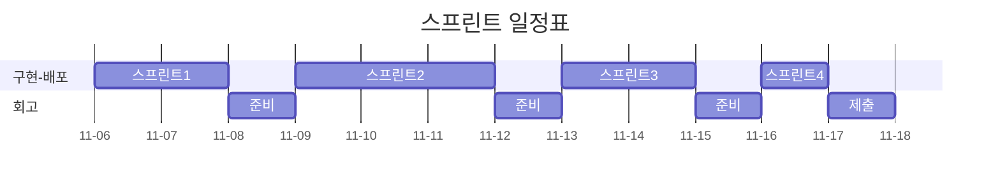

# 오픈미션 회고

*2025-11*

**막막한 감정의 너머**

이번 오픈미션에 대한 설명을 듣고나서 막막한 감정을 마주하고 말았다. 아마 지난 3주간 구체적인 문제와 제약조건이 있는 상황에 익숙해진 탓도 있으리라 생각했다.


얼마전 한강으로 산책을 나갔다가 눈앞의 탁 트인 풍경에 어지러움을 느꼈다. 지난 주차까지 밤낮으로 모니터만 보던 나의 눈이 손을 뻗으면 닿을 정도의 거리감 정도에만 익숙해서 적응을 하지 못한 까닭이었다. 나는 둔치에 잠시 앉아서 숨을 고르며 어지러움증이 잦아들 때까지 기다렸다. 시월의 한강은 구름 한점 없는 하늘 만큼이나 청명했고 한껏 빛을 머금은 윤슬은 무척 생기가 가득했다.

생각해보면 세상은 원래 광활한 편이었다. 문밖은 작은 새소리와 아이들의 웃음소리가 발 디딜 틈 없이 일렁대는 곳이었고, 지하철 역 앞 정류소는 헤아릴 없을 만큼 무수한 감정들이 눈빛 너머로 지나쳐가는 곳이었다. 내가 잠시 잊고 있던 것처럼, 내가 걸음을 멈춘다고해서 행인들은 걸음을 멈추지 않을 것이고 내가 설령 우아한 테크코스에 합격했다고 한들 수료 직후의 내게 한강의 풍경은 지금과 같을 것이라고 생각했다.

그래서 나는 마음을 달리 먹어야겠다고 생각했다. 손에 잡힐듯한 성취에 스스로의 눈을 멀게하고 싶지 않았다. 이번 오픈 미션이 마감을 끝으로 소모되는 단발의 총성이 아니라, 매일 울리는 풍경(風磬)이 되어 생애의 운율로 남았으면 했다. 그래서 지속 가능하고 자족 가능한 성장을 위해서 어떤 것에 마음을 쏟아야 할지를 고민했다. 이러한 생각은 꼬리에 꼬리를 물었고 결국 실제로는 중요하지 않았던 것들을 위시한다며 서랍안에 접어 두었던 생애의 의문을 돌이켜 보게끔 나의 마음을 움직였다.

나는 특정한 주제로 사람을 연결하는 일에 줄곧 흥미를 느껴왔다. 독서모임과 개발 스터디의 시작도 그런 차원에서의 시도였다. 모임을 운영하며 나름의 보람이 있었지만 많은 사람들이 스스로의 능력을 과소평가하고 본인을 드러내기 쑥스러워 하는 까닭에 모임의 문턱 앞에서 돌아갔던 기억들이 여전히 마음 한켠에 숙제처럼 남아있었다. 아마도 '나는 이곳에 어울리지 않아' 같은 내적인 속삭임으로 대변될 수 있을 그 마음들을 생각하면서, 이 문제를 해결하기 위한 시도으로써 이번 오픈 미션을 시작해보면 좋겠다고 생각했다. 그리고 그 미션의 결과물이 '너는 이곳에 어울려' 라는 메세지를 전달해줄 수 있길 원했다.

그래서 나는 수줍음이 많은 사람들을 위한 독서모임 애플리케이션을 만드는 것을 이번 오픈미션 과제로 정했다. 이름은 `Quiet Chatter: You Belong Here`로 정했다. 익명으로 자신을 드러내지 않고 책에 대한 감상을 나누고 좋아요과 공감한다는 반응을 나누게 하면 편안함늘 느낌을 주지 않을까 생각했다. 자신이 글이 영원히 인터넷에 박제될 수 있다는 두려움을 없애기 위해서 시간이 지나면 자동으로 비공개되는 짧은 호흡의 독후감이나 생각을 나눌 수 있으면 좋겠다고 생각했다.

이 어플리케이션에 대한 소개는 [README.md](/README.md)에 적어두었다.

---

**프리코스와 오픈미션**

나는 본 프로젝트가 장차 틀을 깨고 달려나가더라도 지난 3주동안의 프리코스의 과정이 녹아 들어가기를 원했다. 다시말해 본 프로젝트에서 내가 배운 것들을 그대로 응용함으로써 그간의 배움의 과정이 확장되기를 원했다.

그래서 멋진 새 기술이나 언어를 사용해서 화려한 모습을 보이는 것보다 익숙한 기술을 사용하더라도 본 프로젝트를 설계하고 구현하는 디테일에 그간의 진정성을 담고 싶었다. 구체적으로는 나는 지난 3주간 집중했던 객체지향과 그 원칙(OOP & SOLID), 테스트 주도 개발(TDD), 클린코드(Clean Code), 확장가능한 설계 (DDD, 클린 아키텍쳐)를 그대로 녹여내고 싶었다.

하지만 이번 프로젝트를 도전하는데 있어서 새로운 기술의 도입은 필수불가결했다. 누구나 접속 가능한 애플리케이션을 만들기 위해서는 웹과 호스팅 기술이 필요했고 독후감을 남기고 저장하기 위해서는 UI와 데이터베이스 기술이 필요했다.

딜레마는 항상 있다. 그리고 한쪽을 선택하기 보다 중요한 것의 비중을 더 많이 가저가고 필요할 때마다 조정하는 것이 대게 좋은 결정이었던 것 같다. 그래서 새로운 기술의 도입은 최소화하기로 했다.

이러한 취지에 맞춰 언어는 프리코스에서 사용하던 그대로 Java 21을 사용하고 웹 애플리케이션 서버(WAS) 구동을 위해 대중적인 Spring Boot를 사용했다. 호스팅을 위해서 클라우드 서버로 AWS EC2 보다 단순한 LightSail을 사용했다. UI를 위해서 내게 어려운 React 대신 쉬운 ThymeLeaf로 대신하기로 했다. 데이터베이스는 다양한 데이터를 쉽게 담을 수 있는 PostgreSQL을 사용했고 접근기술로는 추상화가 잘된 Spring Data JPA를 도입했다. 추가적으로 통합과 배포(CI/CD)를 미리 설정해두고 신경쓰지 않기 위해서 GitAction과 Docker Compose 정도만 도입했다.

부대 기술을 정했으니 구체적으로 어떻게 이번 오픈미션에서 지난 프리코스에서 배운 것들을 적용할지 적어볼 필요가 있었다. 그래서 나는 다음과 같이 제한조건과 목표를 설정했다.

---

### 나의 오픈미션 목표

**목표:** 오픈미션 과제로 독서모임 애플리케이션 `Quiet Chatter`을 출시한다.

**제한 조건:**

- 지난 프리코스와 같이 [AngularJS Git Commit Message Conventions](https://gist.github.com/stephenparish/9941e89d80e2bc58a153)을 바탕으로 커밋메세지를 작성한다.
- 지난 프리코스와 같이 [Java Style Guide](/docs/development-guide/java_style_guide.md)을 준수한다.
- [클린코드 원칙](/docs/development-guide/clean_code_principles.md)을 가능한 준수한다.
- 지난 프리코스 [1주](/docs/development-guide/week-1-feedback.md), [2주](/docs/development-guide/week-2-feedback.md), [3주](/docs/development-guide/week-3-feedback.md)차 피드백을 준수한다. (아래 요약)
    - README.md를 상세히 작성한다, 기능 목록을 재검토, 업데이트한다
    - 커밋 메시지를 의미 있게 작성한다
    - Java에서 제공하는 API를 적극 활용한다
    - 오류를 찾을 때 출력 함수 대신 디버거를 사용한다
    - 공백을 의미 있게 사용한다, 의미 없는 주석을 달지 않는다
    - 이름을 통해 의도를 드러낸다, 이름에 자료형을 사용하거나 축약하지 않는다
    - 객체의 상태 접근을 제한한다, 데이터를 꺼내지(get)않고 일하도록 한다
    - 값을 하드 코딩하지 않는다, 상수, 멤버 변수, 생성자, 메서드의 순서를 지킨다
    - 필드(인스턴스 변수)의 수를 줄이기 위해 노력한다
    - 연관성이 있는 상수는 static final 대신 enum을 활용한다
    - 메서드가 한 가지 기능만 수행하게 한다, 15라인이 넘지 않도록 구현한다.
    - 테스트의 이유를 @DisplayName에 작성한다, 작은 단위의 테스트를 먼저 작성한다, 예외 케이스도 테스트한다
    - 테스트를 구현 코드에서 분리한다, 테스트가 어려운 코드를 쉽게 만든다. 테스트를 위해 클래스 분리를 고려한다
    - 비즈니스 로직과 UI 로직의 분리한다

**도전할 것**

- 꼭 필요한 기술이 아니면 도입하지 않는다. 도입한 기술이 있다면 그 이유를 명확히 작성한다.
- 스스로 지난 3주차 동안 배운 것을 적극 적용한다.
    - TDD로 개발한다. 테스트 없이 프로덕트 코드를 만들지 않는다
    - 원시값을 도메인 의미가 있는 값객체(Value Object)로 감싸서 사용한다
    - 기능(function)과 기능(feature)을 구분하여 기능(function)에 대한 단위 테스트를 작성하고 이를 기능(feature)으로 묶어 의도를 드러낸다
    - 단위 테스트와 더불어 통합 테스트(전체 스프링을 가동한 API 테스트)를 작성한다
    - 객체간의 의존성을 인터페이스를 통해서 느슨하게 만든다
    - 비지니스를 녹여내기 위해서는 일급콜렉션 사용한다
    - 객체의 불변성과 가변성을 맥락에 맞도록 사용한다. 값-> 불변, 엔티티-> 가변
    - 테스트가 어려운 의존은 모킹하여 테스트한다, 외부 API나 확률을 모킹한다
    - 객체의 상태를 확인하지않고 일을 시킨다
    - 저수준의 도메인 모델을 집약하여 고수준의 도메인 모델을 만든다
    - 계층사이의 의존의 방향이 외부(어댑터)에서 내부(도메인)으로 흐르게 정렬한다

---

**프로젝트 빌드와 첫 스프린트(2025-11-06 TH)**

본 프로젝트를 실행하기에 앞서 나는 단순히 흐릿한 아이디어만 있었고 사전에 준비해온 것이 전혀 없었기 때문에 즉각적인 설계와 발맞춘 개발이 필요했다. 그래서 나는 점진적 개발 모델을 통해서 개발을 수행해야겠다고 생각했다. 처음부터 모든 것을 설계하지 않고 작은 배포 단위로 반복적으로 기획 - 설계 - 구현을 반복하고자 했다.

나는 6일 새벽에 프로젝트 초기 세팅과 아주 간단한 요구사항 작성을 끝내고 깃허브에 첫 푸쉬를 했다. 점진적인 개발을 위해서 일정 간격으로 스프린트를 진행할 예정이다. 오늘부터 작업을 시작해서 현재까지의 다음 배포를 7일에 수행하기로 했다.



---
**1회차 스프린트 작업**

**CI/CD 구축 작업**

- 최소한의 CICD 구축
    -[x] 깃허브 저장소에 시크릿 등록
    - [x] AWS Light Sail 인스턴스 생성
    - [x] 프로젝트 Dokcerfile 작성
    - [x] 깃 액션 배포 스크립트 작성

나는 통합과 배포(CI/CD)를 미리 설정해두고 신경쓰지 않기 위해서 깃허브 액션을 도입하여 최소한의 CI/CD 워크플로우를 도입했다. 나는 스크립트 작성을 못하지만 이 부분은 LLM의 많은 도움을 받았다.

배포방법에 대한 고민도 했는데 jar로 배포하는 것보다 도커로 이미지 단위로 배포하는 것이 따로 서버에 JDK와 같은 필요한 의존성을 따로 관리할 필요가 없어 유리하다고 생각했다. 그래서 통합단계에서 도커이미지를 Push하고 인스턴스에서 직접 Pull해서 Docker Compose로 실행하는 방식을 택했다. 또한 컨테이너 가동에 필요한 환경변수는 서버쪽에서 가지고 있는게 좋겠다는 판단을 했다. docker-compose.yml에 서버와 db에 대한 정보를 작성하고 환경변수도 미리 작성하여 가동했다.

서버를 외부로 공개하기 위해서 클라우드 서비스로 AWS Light Sail을 서버 인스턴스로 적용했다. 이에 대한 별다른 지식이 없는터라 가장 저렴한 Light Sail의 인스턴스를 고르고 말았는데 여유 메모리가 너무 작아 DB를 이미지로 설치하다가 서버가 터지고 말았다. 나중에 사양이 낮아 가용 메모리가 부족했던 사실을 알고나서 더 높은 스펙의 인스턴스를 생성했다. 다음부터는 꼭 실행할 앱의 필요한 메모리를 사전에 계산해야겠다고 생각했다.


최소한의 인프라만 구축하려고 했는데 생각보다 부대 작업에 시간이 무척 많이 소요된 것 같다. 아무쪼록 열심히 씨름한 끝에 결국 첫 배포를 완료하였다 :)

---

**엔티티 설계/ 테스트 기반구축**

- 도메인 표현 기술 설계
    - [x] 엔티티 기본 구조(아이디, 필드 타입) 설계
- 테스트 환경설정
    - [x] 테스트 컨테이너 설정

본격적으로 바로 도메인 모델 구축 작업을 하려고 시도했으나 막상 시작하려고하니 여러 설계적인 고민 때문에 바로 작업에 들어가지 못하고 깊은 공부가 필요했다.

처음 고민했던 부분은 엔티티의 ID 필드를 어떻게 정의할 것인지였다. 보통 많이 사용하는 Long 타입은 엔티티의 ID를 담는 타입으로 쓰기엔 도메인 표현력이 부족했다. 그래서 UUID를 공통 Id 타입으로 두는 것과 직접 엔티티마다의 Id 클래스를 두는 것 사이에서 고민해야했다. UUID의 통용성과 편의성을 선택할지, 각 클래스마다 컨버터 구현이 필요하더라도 도메인 표현성을 높기 위해 Id 클래스를 도입할지에 대한 고민을 하면서 결국 UUID 클래스를 도입하기로 마음 먹었다. UUID는 자바 표준이고 Long 타입보다 표현력이 좋으면서 또한 여러 다른 DB를 사용하더라도 별다른 변경없이 사용이 가능해서 차용했다. 도메인 계층은 확실히 Id라는 모델에 대한 표현력이 좋아지기를 기대했다.

나는 PostgreSQL를 사용했고 로컬 테스트에서도 데이터베이스와 통합된 테스트를 하고 싶었다. 그래서 추가적으로 [학습](https://java.testcontainers.org/modules/databases/jdbc/)을 통해 테스트 컨테이너를 도입하게 되었다. 그리고 제대로된 쿼리가 나갔는지 확인하기 위한 로깅레벨 설정과 테스트 프로파일 설정도 함께 익히게 되었다.

---

**1회차 스프린트 회고**

1회차에서는 본격적으로 프로젝트를 수행하기 위한 빌드, 배포, 테스트 준비 작업이 주를 이루었다. 스프린트를 시작하기에 앞서 최소한의 인프라만 기술과 구축하려고 했는데 생각보다 고려해야할 것도 많고 시행착오도 많았다. 막상 속도를 위해서 최소한의 기술을 도입하려고 했지만 공부를 하다보니 관련 기술이나 좀더 깊게 기술을 다루는 것에 흥미가 생겨서 종종 검색의 삼천포에 빠지기도 했다.

예를 들어 보안을 위해 프라이빗 서브넷을 깔고 프라이빗 서버로 이중화하기, 향후 요청을 캐싱하기 위해 Redis 도입할지, 지금처럼 ThymeLeaf로 서버사이드 렌더링이 아니라 따로 웹서버를 둘지, 보안을 위해서 JWT 방식을 도입할지 같은 것들이다. 1회차 내내 이런 유혹에 시달렸지만 결국 떨처낼 수 있었다.

언급한 기술들은 필요할 것들이고 좋은 기술들이지만 건축으로 따지자면 난방시스템, 보안시스템, 조명시스템 같은 것이라고 생각한다. 아직 집이 지어지지도 않고 사람이 들어와 살지 않는데 이런 것들을 일찍 생각하다보면 사공많은 배가 산으로 가는 것처럼 프로젝트가 진척되지 않을 것이라고 생각했다. 신경이 쓰이는 것은 사실이지만 의도적으로 넘어가는 연습이 필요한 것 같다는 생각이 든다. 서비스를 만드는데 있어서 정말 중요한 것은 사용할 수 있는 서비스를 만드는 일이다.

우아한 테크코스 프리코스 마지막에 있는 최종 코딩 테스트에 대한 얘기들이 생각이 났다. '안돌아가는 프로그램보다 돌아가는 쓰레기를 만들라'는 말처럼 우리가 아는 것을 모두 고려하는 것이 현실적으로 불가능할 때가 많고 중요한 것을 먼저 생각하고 합리적으로 선택해야겠다고 생각하게 되었다.

비단 개발에서만이 아니라 실생활에서도 적용이 되는 말이기도 하다. 나는 지금 필요하지 않은 것들을 생각하고 걱정하느라 지금 해야할 것들을 놓치고 있지는 않을까 반성하게 되었다. 인생에 있어서 우선순위는 거듭해서 스스로 상기하지 않으면 쉽게 질서를 잃어버린다. 내가 그간 신경쓰지 못한 게 무엇일까 생각하다가 이참에 부모님에게 안부전화를 드렸다. 전화기 너머로 현재 우테코 지원에 집중하느라 무직인 내 상황에 대해 걱정과 애정이 섞인 잔소리를 들었지만 기분은 좋았다.

어느덧 시간이 흘러 단풍이 예쁘게 물들고 있었다. 돌이켜본다면 어떤 일을 붙잡고 있느라 계절의 변화를 느껴보지 못했던 적이 종종 있었던 것 같다. 중요한 일이었을 수도 있고 그 때 열심히 하지 않았더라면 지금의 나는 없을 수도 있다. 그래도 확실한 사실은 그 시절의 벚꽃을 볼 정도의 물리적인 여유는 충분했다는 것이다. 다만 이완없는 긴장으로 인해 그럴 생각을 못했던 것 같다. 좋은 풍경은 휴식을 주지만 의도적으로 그런 환경에 머물지 않는다면 휴식을 찾기 어렵겠구나 생각했다.


환경은 그곳에 머무는 사람에게 영향을 준다. 만약 우테코에 합격한다면 우테코라는 환경은 내게 어떤 영향을 줄까? 가능성은 뒤로한채 잠깐 상상해보기도 했다.


---

**2회차 스프린트 작업**

**외부 API를 테스트하기: 네이버 검색**

학습을 통해서 [네이버 개발자 센터에서 책은 검색할 수 있는 API](https://developers.naver.com/docs/serviceapi/search/book/book.md#%EC%B1%85)를 발견하고 사용등록을 했다. API를 사용하는 것은 어렵지 않았다. 다만 외부 API를 테스트 코드에 적용해본 적이 없어서 많은 시행착오를 겪었다.

우선 외부 API는 시간과 비용이 많이 들기 때문에 이를 테스트 하는 것은 기존 단위테스트와는 분리해야했다. 그래서 [org.junit.jupiter.api.Tag를 사용하여 gradle 테스트 테스크에서 제외하는 방법](https://random-topic.tistory.com/190)을 공부하게 되었고 이를 빌드 스크립트에 분리시켰다. 테스트 코드에서는 외부 API 테스트가 필요한 경우에만 `@Tag("external-api")`만 붙였다.

추가로 외부 API 테스트에 필요한 API 키는 보안을 위해서 프로퍼티로 로컬 테스트에서 주입시키는 방법을 알게되었다. `gradle.properties`에서 해당 프로퍼티가 정의되어 있지 않으면 예외를 던지므로 편하게 테스트가 가능했다. Gradle 빌드 스크립트는 내게 익숙치 않았는데 이참에 조금 공부할 수 있어서 좋았다.

```groovy
//build.gradle
tasks.named('test', Test) {
    useJUnitPlatform()
    useJUnitPlatform {
        excludeTags("external-api")
    }
}

tasks.register("testExternalApi", Test) {
    group = "verification"
    description = "외부 API 테스트"

    useJUnitPlatform {
        includeTags("external-api")
    }

    def naverApiClientIdName = 'naver.api.client-id'
    def naverApiClientSecretName = 'naver.api.client-secret'

    systemProperty naverApiClientIdName, project.property(naverApiClientIdName)
    systemProperty naverApiClientSecretName, project.property(naverApiClientSecretName)
}
```

그다음 집중한 것은 외부 API를 모킹하는 테스트이다. 이부분도 경험이 없어서 [검색](https://www.baeldung.com/restclienttest-in-spring-boot)을 통해서 `@RestClientTest`를 사용하면 테스트 클래스에서 간편히 Mock서버를 빈으로 등록할 수 있고 이를 가져와 테스트 할 수 있다는 사실을 알았다.

그래서 나는 네이버 검색 API를 사용하는 빈(NaverBookSearcher.class)가 생성자에서 `RestClient`가 아니라 `RestClient.Builder`를 의존하여 주입받도록 변경했다. 네이버 검색 API를 사용하는 빈(NaverBookSearcher.class)은 해당 빌더를 받아서 필요한 디폴트 URL과 해더를 설정하여 `build()`를 호출하여 직접 `RestClient`를 만들도록 했다.

`@RestClientTest`을 사용하여 테스트에서 전달받는 `RestClient.Builder`을 목서버로 모킹하도록 설정했다. 목서버에 바인딩된 `RestClient.Builder`를 통해 생성된  `RestClient`는 자동으로 목서버와 통신하도록 작동하는 것을 배웠다. 작성된 코드의 예시는 아래와 같다.

```java

@RestClientTest(NaverBookSearcher.class)
class NaverBookSearcherTest {
    @Autowired
    private NaverBookSearcher naverBookSearcher;

    @Autowired
    MockRestServiceServer mockServer;

    @MockitoBean
    private NaverApiEnvironment naverApiEnvironment;

    @Test
    @DisplayName("API 모킹 단위 테스트")
    void findByKeywordMockedApi() {
        mockServer.expect(ExpectedCount.once(), MockRestRequestMatchers.anything())
                .andRespond(withSuccess(
                        """
                                {
                                    "total": 1,
                                    "start": 1,
                                    "display": 1,
                                    "items": [
                                        {
                                            "title": "수레바퀴 아래서",
                                            "isbn": "9788937460500"
                                        }
                                    ]
                                }""",
                        MediaType.APPLICATION_JSON
                ));

        Keyword keyword = new Keyword("수레바퀴 아래서");
        PageRequest pageRequest = PageRequest.of(0, 10);

        Page<Book> books = naverBookSearcher.findByKeyword(keyword, pageRequest);

        assertThat(books.getTotalElements()).isEqualTo(1);
        assertThat(books.getContent()).isNotEmpty();

        assertThat(books.getContent()).allSatisfy(book -> assertThat(book.getIsbn()).isNotNull());
    }
}
```

이번 공부를 통해서 다음부터 외부 API를 모킹하는 테스트를 더욱 자신감 있게 작성할 것 같다는 예감이 든다.


---

**테스트 픽스쳐에 대한 고민과 적용**

[테스트는 어떻게 좋은 코드를 만드는가(feat. 험블 객체 패턴)](https://d2.naver.com/helloworld/9921217)

Quiet-Chatter의 `도서검색기능`은 외부API를 통해서 도서를 조회한 후 서버DB의 책을 `ISBN`으로 조회하여 있는 경우 `책` 정보를 업데이트하고 없으면 검색된 정보로 새로 저장한다.

이 기능을 만들기 위해서는 요청을 받는 컨트롤러와 서비스 그리고 리파지토리 빈들이 각자의 역할을 수행하고 협력하게 된다. 이 빈들은 책 엔티티를 다루는데 이를 단위 테스트하기 위해서는 테스트용 엔티티(Fixture) 객체가 필요하게 된다.

문제는 각 엔티티의 생성자나 수정 메서드는 그 자체로 비지니스 로직을 가지고 있기 때문에 이를 테스트하지 않을 때는 도메인 메서드의 변경이 테스트에 영향을 주지 않아야 한다는 점이다. 따라서 엔티티의 도메인 메서드와 독립적인 테스트 엔티티(Fixture)의 생성이 필요한데 이 작업이 무척 번거로왔다.

이를 수월하게 해줄 유명한 라이브러리가 두개 있었다.나는 네이버의 [FixtureMonkey](https://naver.github.io/fixture-monkey/v1-1-0/), Instancio의 [Instancio](https://www.instancio.org/user-guide) 를 차례로 적용해보았는데 결국 Instancio를 선정했다. 해외에서도 좀더 많이 사용되는 것 같고 별다른 객체 생성이나 옵션 설정 없이 정적 메서드로 바로 Fixture 생성이 가능했기 때문이다.

그리고 [DataFaker](https://www.datafaker.net)를 사용하여 좀더 책의 일렬번호(ISBN)과 같은 도메인적인 가짜 데이터를 테스트에 활용하기로 했다. 아래는 그 사례이다.

```java
public class BookFixture {

    public InstancioApi<Book> asNew() {
        return initBook().ignore(fields().declaredIn(BaseEntity.class));
    }

    private static InstancioApi<Book> initBook() {
        final Faker faker = new Faker(Locale.KOREA);

        return of(Book.class)
                .set(field(Book::getTitle), new Title(faker.book().title()))
                .set(field(Book::getIsbn), new Isbn(faker.code().isbn13()));
    }

    public InstancioApi<Book> asPersisted() {
        return initBook();
    }
}

```

처음에는 Fixture 라이브러리를 도입하는 것이 오버하는 것이 아닌가 회의감이 들었지만 이정도 수준의 새로운 기술 도입은 이유가 명확해서 괜찮았던 것 같다. 앞서 설명한대로 엔티티의 도메인 메서드와 독립적인 테스트 엔티티(Fixture)의 생성이 필요한 경우가 꼭 필요하기 때문이기도 하고 단순히 유틸 라이브러리이기 때문에 적용에 있어서 변경할 것이 없었던 것도 한 몫을 하였다.

이런 것을 공부하면 할 수록 표준화된 라이브러리로 빌드하는 것이 무척 중요하다고 느끼고 있다. 다양한 라이브러리 보다 신뢰할 수 있는 라이브러리와 그 API를 활용하면 좀더 핵심 도메인에 더 집중할 수 있다고 느끼고 있다.


---

**IP 에서 Domain으로 그리고 HTTP 에서 HTTPS로**

아마존의 라이트세일 인스턴스는 정적 IP 매칭을 지원해준다. AWS에서 사용가능한 IP를 매칭하여 같은 경로로 접속할 수 있도록 변경해두었지만 곧 데모를 론칭하여 사용자의 피드백을 받으려면 좀 더 신뢰성있는 도메인을 두는 것이 좋겠다고 판단했다.

그래서 가비아에 접속하여 도메인을 구입하고 이를 라이트세일에 매칭하였다. AWS 콘솔이 상당히 추상화가 잘되어있어 별다른 서버 설정 없이 바로 적용이 가능해서 좋았지만 여전히 포트는 스프링부트의 8080 기본 포트를 적용하고 있었기에 웹브라우저의 주소 입력창에 포트를 적어야만 접속이 가능한 불편함이 있었다.

처음에는 스프링부트의 포트를 80 포트로 변경하여 HTTP 기본포트를 사용하게끔 하려고 했으나 직접 이 포트와 연결하는 방식은 보안상 권장되지 않는다는 사실을 알게되었다. 그래서 서버에 Nginx 웹서버로 리버스 프록시를 설정해두기로 했다. 웹서버로 80 포트 요청을 받아서 서버의 localhost:8080으로 전달하게 바꾸었다. 설정은 어렵지 않았다. 앞서 Docker compose를 적용해 두었기 때문에 간단한 yml 수정과 설정파일 추가로 이것이 가능했다.

추가적으로 보안접속을 위해서 `Certbot`을 사용하여 `Let's Encrypt`으로부터 SSL 인증서을 발급하고 NginX에 등록하여 최종적으로 보안접속이 가능하도록 수정했다.

이 모든 작업은 내가 머리로는 개념적으로 알고는 있었지만 해본적은 없던 것이었다. 때문에 많은 시행착오를 겪어야만 했다. 각종 라이브러리들은 내가 처음 써보는 것들이라서 헤매기도 했다. 아직까지도 반정도도 이해하지 못했지만 검색과 LLM을 통해서 구축은 가능했다. 일년 사이에 정보의 접근성이 좋아져서 이렇게 많은 작업을 할 수 있어서 정성스럽게 구축방법을 정리해둔 여러 개발 블로그에 무척 감사했다. 이 정보글 덕분에 결국 나의 홈페이지도 HTTPS를 사용해 https://quiet-chatter.com 으로 접속이 가능해졌다!


---


**2회차 스프린트 회고**

이틀간의 작업에서는 보다 도메인 로직에 집중하려고 했으나 생각보다 도메인 구축, HTTPS, 보안 관련 작업이 절반이상을 차지할 정도로 오래 걸렸다. 사실 도메인로직에 집중해서 다른 제반 기술을 건드리지 않고자바만 개발하는 것은 개발자의 이상일지도 모르겠다는 생각을 한다. 어쩌면 이렇게 얕고 넓게 알아서 전체 시스템을 구축해나가는 경험이 결국 어떻게든 도움이 될 것이라는 생각을 한다.

정말 멋있는 자바 로직 코드를 작성하고 싶은 욕심도 있다. StreamAPI를 사용하여 3개의 메소드가 할 일을 하나로 단 몇줄만에 만든다거나 하는일, EventPublisher등을 이용해서 구조적으로 결합이 낮으면서도 효율적인 프로세스를 만드는일, 스레드와 동시성을 공부해서 이를 효율적으로 구현하여 대량의 트래픽을 견뎌낼 수 있는 코드를 만들어보는 것. 이것들은 모두 이상적으로 내가 바라는 것들이다.

다만 처음 접속할 사람들이 신뢰할 수 있는 도메인이름과 HTTPS를 지원하는 것을 우선한 것은 꼭 필요한 일인 것 같다. 서비스의 본질은 사용자이니 사용자 중심의 서비스를 만들어 나가야겠다는 생각은 든다. 그렇다고 제반기술에 너무 푹빠지지도 않고 필요한건만 선택적으로 추려서 적용하는 일이 중요하다는 생각이 이번 2회차 스프린트에서 들었다.

이번 2회차에서는 정말 구축해야할 것을 모두 해놓은 것 같다. 테스트 기반도 잘 잡혀있고 인프라도 이정도면 무척 안정적이다. 지금까지 힘을 모았으니 앞으로는 쭉쭉 죽순처럼 자랄 수 있겠다는 생각이 든다.

다음 3회차 스프린트에서는 유저 API와 북톡 API를 최소 수준으로 완성하고 공식 홍보에 나갈 목표를 세웠다. 실제 유저들의 트래픽과 피드백을 받아서 개선을 해나가는 것이 목표다.


---

**3회차 스프린트 작업**

**비로그인 독후감 작성기능: 익명인증 기능 추가하기**

Quiet Chatter는 익명성을 중요한 가치로 두고 있다. 나는 사용자가 로그인을 하지않고 북톡(독후감)을 작성하도록 허용하고 싶었다.

그러나 애플리케이션 입장에서는 상황이 달랐다. 사용자가 로그인 폼에서 로그인을 하는 것과 별개로 서버에서는 접속한 사용자를 인식하고 식별할 필요가 있었다.

나는 앞서 TymeLeaf를 통해 클라이언트 페이지를 서버사이드에서 렌더링하고 있었으므로 Session 기반의 Stateful한 인증을 하는 편이 좋겠다고 생각했다. 따라서 접속한 사용자를 식별하기 위해서는 접속한 세션을 인증하는 과정이 필요했다. 이는 곧 서버 입장에서의 로그인과 같았다.

그래서 나는 Spring Security를 우선 의존성에 추가했다. 그리고 따로 지정하지 않은 경로는 Anonymous가 접근할 수 있도록 설정을 추가했다. 이를 바탕 설정으로 사용하되 필요할때에만 인증객체를 생성하도록 "ROLE_GUEST" 권한을 가지는 Guest 인증객체를 따로 구성할 필요가 있었다. 그래서 커스텀 인증 필터를 추가하여 특정 url로 접속했을 때 인증 상태가 Anonymous 인경우 "ROLE_GUEST"를 인증을 Spring Security Context에 업데이트 할 수 있는 기능을 추가하였다. 이 과정에서 Anonymous는 세션 자원을 절약하기 위해서 기본값으로 Spring Security에서 따로 세션을 만들지 않는다는 사실을 학습을 통해서 알게 되었다.

작성하고보니 간단한 작업이었는데 막상 Spring Security를 잘 모르다보니 시행착오가 많았다. CSRF설정과 Spring Security 인증절차에 대한 여전히 헷갈리는 부분들이 많은데 이 부분은 실제로 론칭을 하면서 수정해야할 것 같다는 생각이 들었다.

**Anonymous 를 Guest로 승격하는 인증필터를 테스트하기**

사실 시큐리티를 구성하는 자체는 검색을 통해서 구축할 수 있어도 이것이 정말 잘 작동하는지 테스트하는 것은 내가 이 프로젝트를 계획하면서 세운 목표(테스트 없는 프로덕트 코드를 만들지 않는다)의 목표를 달성하기 위해서는 꼭 필요했다.

하지만 그 테스트를 작성하는 과정은 무척 어려웠다. 우선 스프링 시큐리티는 일반적으로 자동구성이 되고 내가 보통 작성하는 Controller 후단이 아니라 전단의 SecurityFilterChain에서 작동하기 때문에 이를 일반적인 MVC 테스트로 하는 것은 불가능 했다. 세션을 관리하는 것도 스프링 시큐리티에서 위임하기 때문이다.

따라서 테스트에서는 프로덕트 코드에서 작성한 필터를 그대로 사용하되 그 필터에서 의존하는 기능을 적절히 모킹할 필요가 있었다.

우선 모킹해야할 것은 Anonymous 를 Guest로 승격하는 인증필터, 즉 커스텀 필터가 인자로 전달받은 HttpServletRequest가 해당 필터가 직접 관여할 대상인지를 확인하는 RequestMatcher를 제공받게 하는 인터페이스였다. 나는 이를 다른 인터페이스로 분리하여 빈으로 등록하게 해두었고 테스트안에서는 @TestConfiguration을 통해서 프로덕트의 빈이 아니라 따로 모킹하여 테스트용 RequestMatcher를 제공하는 빈을 @Primary 애노테이션을 통해서 프로덕트의 SecurityConfiguration에서 이 모킹된 빈을 사용토록했다. 또한 RequestMatcher는 실제 컨트롤러와 매핑되어야하므로 200응답만을 하는 가상의 컨트롤러와 이 경로를 매핑하였다.

다음으로 모킹할 것은 Authentication을 제공하는 AuthenticationProvider였다. 커스텀 필터는 요청이 RequestMatcher에 적합하고 현재 인증상태가 Anonymous에 해당할 경우 AuthenticationProvider를 통해 어플리케이션에게 게스트 멤버 생성 요청을 해서 멤버를 생성하고 이를 바탕으로 AuthenticationToken을 발행받아 이를 Spring Security Context에 등록해야했다. 따라서 AuthenticationProvider를 인터페이스로 선언하고 이를 모킹하여 따로 데이터베이스 호출 없이 임의의 AuthenticationToken을 리턴하도록 했다.

마지막으로 이를 테스트할 테스트 클래스에서는 SecurityConfiguration을 Import하고 MockMvc를 사용하여 SecurityMockMvcResultMatchers를 통해서 실제로 Session에 등록된 Authentication의 authorities를 검증하도록 했다.

아래는 작성한 코드이다.

```java
package maskun.quietchatter.adaptor.web.security;

@WebMvcTest(GuestPromotionTest.FakeController.class)
@Import({SecurityConfig.class,
        WebConfig.class,
        AuthTokenProvider.class,
        GuestPromotionTest.FakeController.class})
class GuestPromotionTest {
    static final String PROMOTION_PATH = "/api/promotion";
    static final String ANONYMOUS_PATH = "/api/anonymous";

    @MockitoBean
    private AuthTokenProvider authTokenProvider;

    @Autowired
    private MockMvc mockMvc;

    @BeforeEach
    void setUp() {
        when(authTokenProvider.getGuest()).thenReturn(getGuestAuthToken());
    }

    private static @NotNull UsernamePasswordAuthenticationToken getGuestAuthToken() {
        return new UsernamePasswordAuthenticationToken(UUID.randomUUID(), null,
                List.of(new SimpleGrantedAuthority("ROLE_GUEST")));
    }

    @Test
    @DisplayName("필요한 경우 자동 승급")
    void promotion() throws Exception {
        mockMvc.perform(get(PROMOTION_PATH).with(csrf()))
                .andExpect(status().isOk())
                .andExpect(SecurityMockMvcResultMatchers.authenticated().withRoles("GUEST"));
    }

    @Test
    @DisplayName("승급이 필요하지 않은 경우 session을 만들지 않으므로 Authentication이 null임")
    void anonymous() throws Exception {
        mockMvc.perform(get(ANONYMOUS_PATH))
                .andExpect(status().isOk())
                .andExpect(SecurityMockMvcResultMatchers.unauthenticated());
    }

    @TestConfiguration
    public static class SecurityTestConfig {

        @Primary
        @Bean
        public GuestPromotion guestPromotion() {
            return () -> {
                Builder builder = PathPatternRequestMatcher.withDefaults();
                return List.of(
                        builder.matcher(HttpMethod.GET, PROMOTION_PATH)
                );
            };
        }
    }

    @RestController
    public static class FakeController {

        @GetMapping(PROMOTION_PATH)
        public ResponseEntity<?> getPromotions() {
            return ResponseEntity.ok().build();
        }

        @GetMapping(ANONYMOUS_PATH)
        public ResponseEntity<?> handleAnonymousRequest() {
            return ResponseEntity.ok().build();
        }
    }
}

```

나에게 있어서 인증 필터의 동작을 테스트해본 것은 처음이기도 하고 많이 헤맨것도 사실이다. 하지만 이번 기회를 통해서 Spring Security Chain 동작을 좀 더 잘이해하게 되었고 테스트에서 어떤 모킹을 해야하고 어떤 설정을 가져와서 적용해야하는지 포괄적인 이해가 생긴 것 같아서 좋았다.

만약 운영환경에서 시큐리티 체인에 문제가 있어 이를 디버깅으로 확인하려면 어떻게 해야할지 여전히 고민이지만 테스트라도 작성하게 되어서 적어도 원하는 동작대로 작동할거라는 기대감을 가질 수 있었다.

**JPA연관관계에 대한 고민: 엔티티 or ID 참조**

JPA를 영속기술로 사용하면서 엔티티끼리의 연관관계를 필드 참조 방식(@ManyToOne과 같은 관계지정 방식)이 익숙했어서 그렇게 해왔는데 막상 그렇게 하니 여러 문제가 있었다.

우선 Spring Data JPA가 제공하는 리파지토리 인터페이스의 쿼리메소드방식을 사용하여 추상메서드인 FindByMemberId(UUID memberId)를 선언하게되면 말그대로 멤버의 아이디를 where절에 넣은 SQL이 나가는 것이 아니라 멤버 테이블과 찾고자하는 엔티티의 테이블에 대한 조인이 발생하게 되었다. 따라서 불필요한 조인이 발생해서 연관 ID을 활용한 조회 SQL에 효율적이지 않았다. 이는 Spring Data JPA의 쿼리메서드가 구문을 해석하는 방법에 따른 것이라서 따로 JPQL쿼리를 작성하거나 인자에 Member를 직접 넣는 방식의 쿼리메서드를 작성하지 않으면 안되었다.

또한 테스트시에도 어려운 점이 있었다. Talk은 Member와 연관관계를 가지는데 JPA를 다뤄서 데이터베이스를 직접 테스트할 때에 영속단계가 아닌 Member를 연관관계로 참조하고 있는 Talk을 Persist 시켜서 DB에 쓰는 것은 불가능했다. 이것이 가능하려면 Member가 이미 DB에 저장되어 영속상태여야하는데 Talk을 테스트하기 위해서 Member 를 영속상태로 일일이 저장하는 것은 무척 번거로웠으며 불필요한 결합이라고 생각하게 되었다.

JPA에서 연관 엔티티를 필드로 참조하는 것은 분명한 장점이 있었다. 영속성 컨택스트 안에서 필드접근을 통해서 그래프 탐색이 가능하고 필요시 추가적인 데이터를 로딩하여 활용이 가능하다. 나도 JPA는 자바 영속성에 있어서 표준 기술인데 그중 가장 중요한 연관관계 매핑을 사용하지 않는다는 것에 주저함을 느꼈다.

좀더 확실한 판단을 위해서 검색과 여러 사례를 학습하게 되었고 많은 사례에서 JPA의 필드 참조 연관관계 매핑의 장점을 인정하면서도 실무적인 차원에서 이를 지양한다는 것이 좀더 다수의 의견인 것을 알게되었다. 또한 좋아하는 최범균 님의 저서 [도메인 주도 개발 시작하기](https://www.aladin.co.kr/shop/wproduct.aspx?ItemId=291420687)을 다시 읽게 되었는데 애그리거트 간의 불필요한 참조 결합을 끊기 위해서 각각 ID를 가지는 것을 권장하는 내용을 바탕으로 최종적으로 각 엔티티에서 다른 엔티티에 대한 참조를 ID만 가지고 있게 하도록 엔티티 설계 방향을 변경했다.

하지만 JPA의 엔티티 필드 참조 방식은 여전히 사용할 여지는 두었다. 만약 어느 애그리거트루트의 하위 애그리거트 컬렉션을 직접 참조하고 다뤄야할 경우 하위 애그리거트를 ID로 참조하는 방식은 불편하다. 하위 애그리거트는 상위 애그리거트루트의 라이프 사이클의 종속적이므로 이런 경우는 ID 참조가 아니라 엔티티 필드 참조 방식이 더 적절할 것으로 생각되었다. 그래서 앞으로 이러한 구조가 나온다면 ID를 참조할지, 아니면 연관관계 필드로 참조할지는 취사 선택해야겠다는 생각이 들었다.

**3회차 스프린트 회고**

이번 3회차는 어떻게 지나갔는지 모를 정도로 정말 빠르게 지나갔다. 본의 아니게 Spring Security의 늪에서 많은 시간을 허우적대고 말았다. 힘들긴 했지만 좋은 경험이었다. 이번에 내가 잘 알지 못하는 영역이 Spring Security인것을 잘 알게 되었다. 사실 프로덕션 코드를 만드는데 있어서 이러한 제반기술을 잘 "이해"하고 있는 것이 무엇보다 중요하겠구나 생각이 들었다. 단순히 비지니스 로직을 짜는 것은 누구나 시간을 들이면 할 수 있다. 그러나 보안은 꼭 필요하고 어쩌면 여러 비지니스 로직이 실행될 때의 엔트리이기 때문에 동작을 정확하기 이해하지 않으면 어렵겠다는 생각이 들었다.

사실 내가 공부를 미뤄온 것이기도하다. 인프런의 정수원님의 스프링시큐리티 강의를 장바구니에만 담아두고. 이게 너무 긴 강의라 주저함도 느꼈는데 마치 미국 드라마를 몰아서 보듯, 밥먹을 때도 틀어놓고 봐야하지 않을까 하는 생각이 들었다. 아뿔싸.. 인프런에 아직 완강못한 강의가 너무 많아서 그것부터봐야겠다. 정수원님의 스레드와 동시성 강의도 우선 봐야겠다.

3회차 스프린트에서는 실제 앱을 출시하고 사용자 피드백을 받아보는 것이 목표였다. 이를 미안하지만 지키지 못했다. 피드백을 받으려면 ui에서 피드백 작성 페이지를 따로 두어야겠다는 생각이 들었다.

아직 좋아요나 공감해요 같은 기능을 추가하지 못했다. 이를 추가하고 론칭해봐야겠다는 생각이 든다. 이번 오픈미션이 2주인줄 알았는데 3주인것을 보니 딱 2주가 되는 날에 론칭하고 계속 피드백을 받아야겠다고 생각했다.

그러니까 다음 스프린트에서는 이를 론칭하려고한다.


